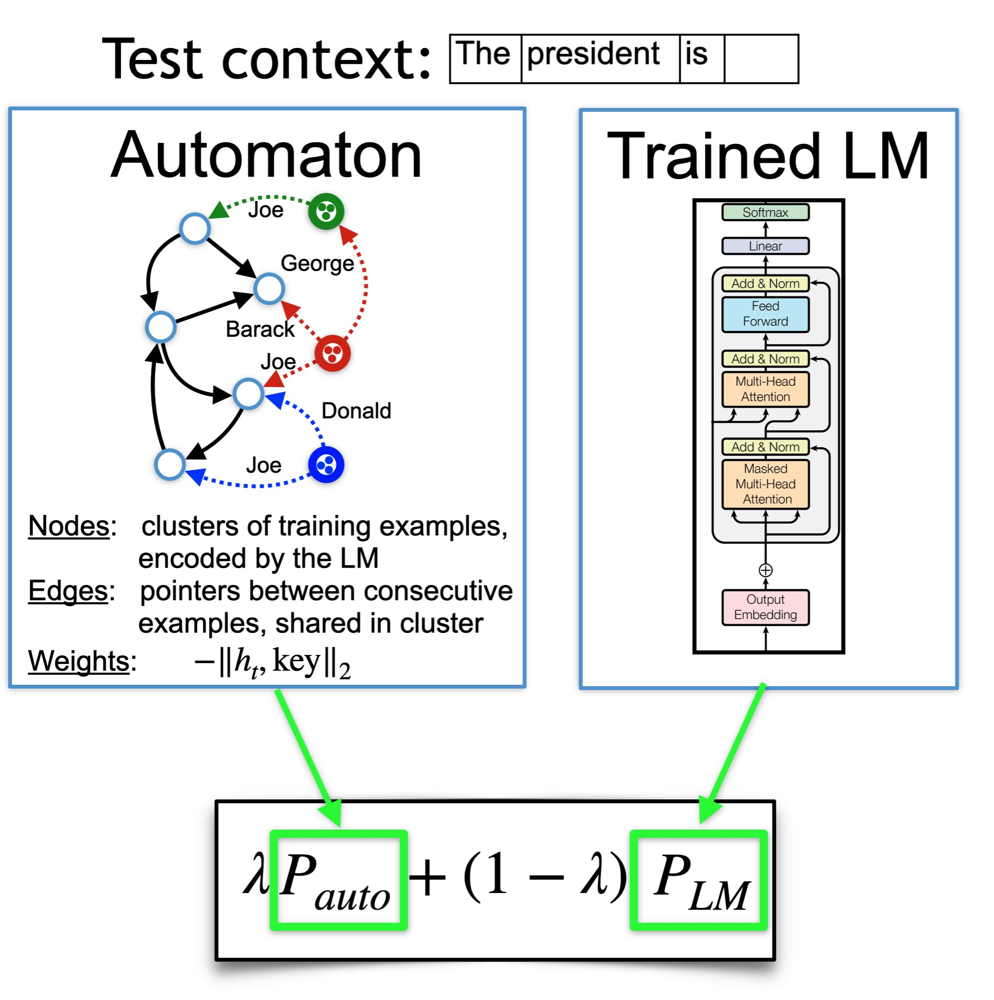
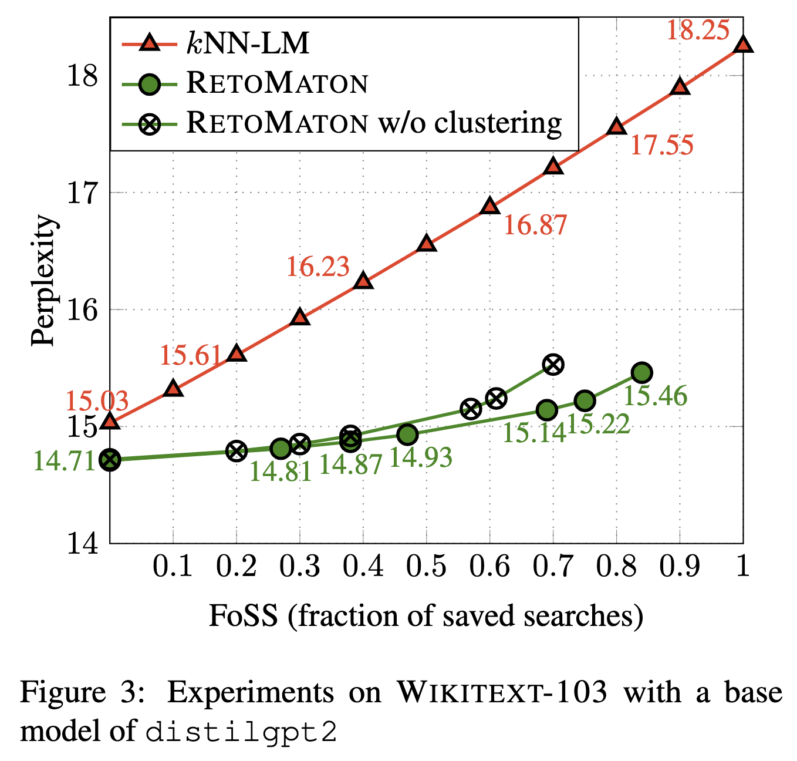
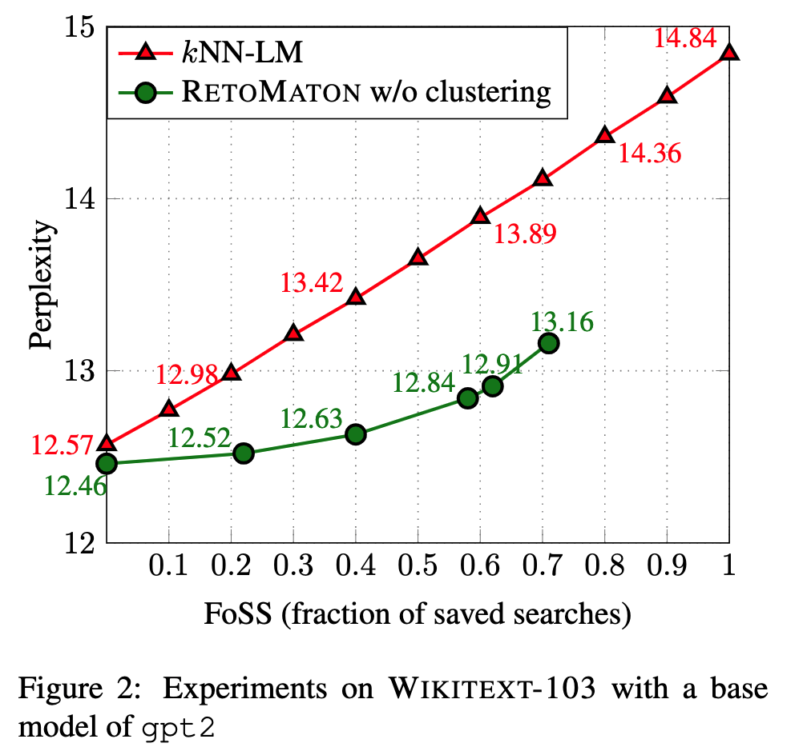
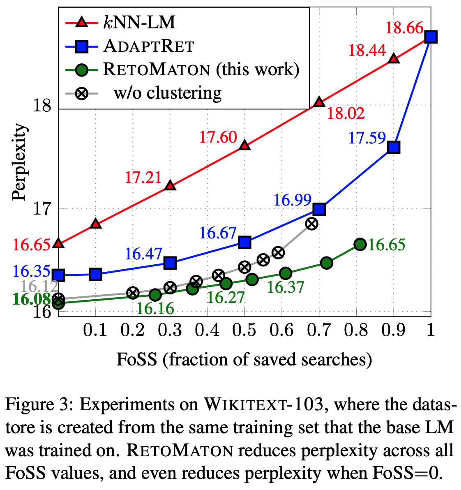

# kNN-transformers: Nearest-Neighbor Language and Machine Translation Models based on Hugging Face's 🤗 `transformers` library

This is a Hugging Face's 🤗 `transformers` implementation of k-nearest-neighbor-based language models and machine translation models,
designed to be easy and useful in research, and for experimenting with new ideas in kNN-based models. 

All previous kNN-LM based implementations are implemented in the `fairseq` library, and **they forked/duplicated the library's entire codebase** to implement their modification.
These include the official kNN-LM repository [https://github.com/urvashik/knnlm](https://github.com/urvashik/knnlm), the kNN-MT repository [https://github.com/urvashik/knnmt](https://github.com/urvashik/knnmt), the official RetoMaton repository [https://github.com/neulab/retomaton](https://github.com/neulab/retomaton), and others.


We implement [k-nearest-neighbor language model (kNN-LM)](https://arxiv.org/pdf/1911.00172.pdf) (Khandelwal et al., ICLR'2020), [k-nearest-neighbor machine translation (kNN-MT)](https://arxiv.org/pdf/2010.00710) (Khandelwal et al., ICLR'2021) and this is also
an official implementation of the RetoMaton model described in:
[Neuro-Symbolic Language Modeling with Automaton-augmented Retrieval](https://arxiv.org/pdf/2201.12431.pdf) (ICML'2022). Most importantly, we implement these models in 🤗 `transformers`, and without modifying the `transformers` library itself.

To use this repository, all you need to do is copy its `*.py` files into your project.
You can load any language model from Hugging Face's hub (such as `gpt2`), by `model = AutoModelForCausalLM.from_pretrained(...)`, build a datastore or download ours (need to be performed only once), and then:
```python
knn_wrapper = KNNWrapper(...) # or: RetomatonWrapper(...)
knn_wrapper.break_into(model)
```

That's it! The model now internally uses kNN-LM or RetoMaton (see a concrete example at [run_clm.py](run_clm.py#L427-L438))

The files `knnlm.py` and `retomaton.py` are standalone and can be copied to any project. The file `run_clm.py` is a modified version of [this example by huggingface](https://github.com/huggingface/transformers/blob/main/examples/pytorch/language-modeling/run_clm.py) which shows an example of how to load and run kNN-LM and RetoMaton.
The file `run_translation.py` is a modified version of [this translation example by huggingface](https://github.com/huggingface/transformers/tree/main/examples/pytorch/translation), which shows how to use our code for kNN-MT and RetoMaton.


This repository is maintained by [Uri Alon](https://urialon.ml).
Please let us know if anything is not working as expected, and feel free to create [new issues](https://github.com/neulab/knn-transformers/issues) or email [ualon@cs.cmu.edu](ualon@cs.cmu.edu) with any questions.
Contributions are welcome!


Table of Contents
=================
  * [Background](#background)
  * [Available Models](#available-models)
  * [Results](#results)
  * [Quickstart](#quickstart)
    * [Requirements](#requirements)
    * [Step 1: Evaluating the base Language Model](#step-1-evaluating-the-base-language-model)
    * [Step 2: Saving a Datastore](#step-2-saving-a-datastore)
    * [Step 3: Building the FAISS index](#step-3-building-the-faiss-index)
    * [Step 4: Evaluating Models](#step-4-evaluating-models)
    * [Step 5: Adding clustering](#step-5-adding-clustering)
  * [Machine Translation (kNN-MT)](#machine-translation-knn-mt)
  * [All files](#all-files)
  * [Differences from the kNN-LM implementation](#differences-from-the-knn-lm-implementation)
  * [Citation](#citation)

## Background

### kNN-LM and kNN-MT
The k-nearest neighbor language model takes an already-trained model, performs a single forward pass over the entire training set, and creates a datastore of `(key,value)` pairs, where `key` is a hidden representation of the trained model after reading a training example, and `value` is the token that should be predicted next.

At test time, for every predicted token, the model performs a k-nearest neighbors search in the datastore, retrieves the `(key,value)` pairs that are closest to the test hidden representation, and normalizes their distances using softmax. Finally, the model interpolates the base LM's probability with the probability formed by the retrieved nearest neighbors and their normalized distances.
For more details, see the [paper by Khandelwal et al., ICLR'2020](https://arxiv.org/pdf/1911.00172.pdf)

kNN-MT is similar to kNN-LM, but it addresses seq2seq/encoder-decoder models, mainly for machine translation. For more details, see the [paper by Khandelwal et al., ICLR'2021](https://arxiv.org/pdf/2010.00710.pdf)


### RetoMaton
RetoMaton extends kNN-LM and kNN-MT, by (1) saving a *pointer* in every datastore entry; and (2) clustering entries according to their keys. That is, every datastore entry is now a tuple `(key,value,pointer)`, and it belongs to a cluster. 

These two changes create an automaton from the datastore, where states are clusters, edges are pointers (shared among examples in the same cluster), and transition weights are the normalized distances between the test representation and each key.

At test time, the model traverses the automaton, and follows the edges according to the token that was predicted.
This allows to save up to 80% of the kNN searches by following pointers instead of performing the expensive search, or reducing perplexity without saving searches.

For more details, see the [paper by Alon et al., ICML'2022](https://arxiv.org/pdf/2201.12431.pdf)

<center style="padding: 40px"></center>

## Available Models

kNN-LM and RetoMaton datastores depend on the LM that was used to create them. We fine-tuned a few `gpt2`-based models on the training set of Wikitext-103 (because Wikitext-103 was not included in GPT2's pretraining data):
* `neulab/distilgpt2-finetuned-wikitext103`
* `neulab/gpt2-finetuned-wikitext103`
* `neulab/gpt2-med-finetuned-wikitext103`
* `neulab/gpt2-large-finetuned-wikitext103`

All these models are available at the Hugging Face Hub and can be loaded by (for example):
```python
from transformers import AutoTokenizer, AutoModelForCausalLM

tokenizer = AutoTokenizer.from_pretrained('neulab/gpt2-finetuned-wikitext103')
model = AutoModelForCausalLM.from_pretrained('neulab/gpt2-finetuned-wikitext103')
```

This project is not limited to these models, and can work with any language model or seq2seq model.

We fine-tuned all language models using:
```bash
python run_clm.py --model_name_or_path <base_model_name> \
    --dataset_name wikitext --dataset_config_name wikitext-103-raw-v1 \
    --do_train --do_eval --output_dir finetune_gpt2_wikitext103/ \
    --save_total_limit 5 --per_device_train_batch_size 2
```
Where `<base_model_name>` is, for example, `gpt2`, `distilgpt2`, `gpt2-med`, `gpt2-large`, or `gpt2-xl`.

We have not yet released finetuned machine translation models, but the code in this repository works for machine translation as well, using the `run_translation.py` script.

## Results - **Wikitext-103**
The exact results from the RetoMaton papers can be reproduced using the code at [https://github.com/neulab/retomaton](https://github.com/neulab/retomaton) (based on `fairseq`).

The following results were obtained using the code in this repository:


| Base LM:        | `distilgpt2` | `gpt2` | `gpt2-medium` |
| :---            |    ----:   |     ---: | ---:          |
| base perplexity | 18.25      | 14.84    | 11.55         |
| kNN-LM          |  15.03     |   12.57  |  **10.59**      |
| RetoMaton       | **14.71**  | **12.44**| **10.59**     |

And when varying the fraction of saved searches:

<center style="padding: 40px"></center>
<center style="padding: 40px"></center>
These are the results from the RetoMaton paper, on a model that was trained on Wikitext-103 from scratch:
<center style="padding: 40px"></center>

## Results - **Translation**
On the validation set of `--dataset_name wmt16 --dataset_config_name ro-en`.

| Base model:     | `t5-small` | `t5-base` | 
| :---            |    ----:   |     ---: | 
| base BLEU       | 26.15      | 27.70    | 
| + kNN-MT          |  **26.42**     |  **27.92**  | 
|                   | `--knn_temp=50 --k=32 --lmbda=0.25` | `--knn_temp=200 --k=512 --lmbda=0.2`

**If you perform additional experiments with our code, we would love to learn more about your results and share them here!**

## Quickstart - Language Modeling

### Step 0: Clone this repository:
```bash
git clone https://github.com/neulab/knn-transformers
cd knn-transformers
```

#### Requirements 
Run:
```bash
pip install requirements.txt`
```

* The project also depends on the `faiss` library. In MacOS, use the Anaconda installation instead:
```
conda install -c conda-forge faiss-cpu
```

### Step 1: Evaluating the base Language Model

To evaluate the fine-tuned model (for example, `neulab/gpt2-finetuned-wikitext103`) on the validation set (without any retrieval):

```bash
MODEL=neulab/gpt2-finetuned-wikitext103

python -u run_clm.py \
  --model_name_or_path ${MODEL} \
  --dataset_name wikitext --dataset_config_name wikitext-103-raw-v1 \
  --output_dir checkpoints/${MODEL} \
  --do_eval --eval_subset validation
```

### Step 2: Saving a Datastore

You can either download our preprocessed Wikitext-103 datastores, or preprocess them yourself.

To download a datastore for Wikitext-103 that we created for the finetuned `gpt2` model (`neulab/gpt2-finetuned-wikitext103`):
```bash
wget -P checkpoints/gpt2/ https://knn-transformers.s3.amazonaws.com/gpt2/dstore_gpt2_116988150_768_vals.npy
```

Similarly, we created datastores using the `distilgpt2-finetuned-wikitext103`, `gpt2-med-finetuned-wikitext103` and `gpt2-large-finetuned-wikitext103`.
For all available datastores, see: [https://knn-transformers.s3.amazonaws.com/index.html](https://knn-transformers.s3.amazonaws.com/index.html)

To save a datastore, run:
```bash
MODEL=neulab/gpt2-finetuned-wikitext103

python -u run_clm.py \
  --model_name_or_path ${MODEL} \
  --dataset_name wikitext --dataset_config_name wikitext-103-raw-v1 \
  --do_eval --eval_subset train \
  --output_dir checkpoints/${MODEL} \
  --dstore_dir checkpoints/${MODEL} \
  --save_knnlm_dstore
```


### Step 3: Building the FAISS index

The FAISS index requires a training phase where it learns an index for accessing the keys quickly. This step does not require a GPU.

To download an index for the finetuned `gpt2` model (`neulab/gpt2-finetuned-wikitext103`):
```
wget -P checkpoints/gpt2/ https://knn-transformers.s3.amazonaws.com/gpt2/index_gpt2_116988150_768.indexed
```

Similarly, we trained `faiss` indexes for  `distilgpt2-finetuned-wikitext103`, `gpt2-med-finetuned-wikitext103` and `gpt2-large-finetuned-wikitext103`, see: [https://knn-transformers.s3.amazonaws.com/index.html](https://knn-transformers.s3.amazonaws.com/index.html)

To build the FAISS index yourself (not needed if you already downloaded ours):
```bash
MODEL=neulab/gpt2-finetuned-wikitext103

python -u run_clm.py \
  --model_name_or_path ${MODEL} \
  --dataset_name wikitext --dataset_config_name wikitext-103-raw-v1 \
  --output_dir checkpoints/${MODEL} \
  --dstore_dir checkpoints/${MODEL} \
  --build_index
```


### Step 4: Evaluating Models

To evaluate kNN-LM and RetoMaton on the validation set:

```bash
MODEL=neulab/gpt2-finetuned-wikitext103

python -u run_clm.py \
  --model_name_or_path ${MODEL} \
  --dataset_name wikitext --dataset_config_name wikitext-103-raw-v1 \
  --output_dir checkpoints/${MODEL} \
  --do_eval --eval_subset validation \
  --dstore_dir checkpoints/${MODEL} --retomaton
```

To use kNN-LM, use the `--knn` flag instead of `--retomaton`.

To encourage the RetoMaton model to perform a full kNN search more frequently and thus increase accuracy and reduce perplexity, use a larger value of `--min-knns` such as `100`. Using `--min-knns 9999999` makes the model perform kNN search at every step (`FoSS = 0` in Figure 3 of the paper), and achieves the best results at the cost of slower speed.

Additional possible test-time tunable hyperparameters are `--lmbda` (the interpolation factor between the datastore and the base LM), `--k` (the number of retrieved nearest neighbors) and `--knn_temp` (the softmax temperature when converting the nearest-neighbor distances into a probability distribution).

### Step 5: Adding clustering

RetoMaton can work without clusters, in which is utilizes its pointers only.
Using clustering allows it to save more nearest-neighbor searches and further reduce perplexity.

To download our processed clusters the finetuned `gpt2` model (`neulab/gpt2-finetuned-wikitext103`):
```
wget -P checkpoints/gpt2/ https://knn-transformers.s3.amazonaws.com/index.htmlgpt2/members_gpt2_116988150_768_20000000_500000.pkl
```

Similarly, we also provide clusters for the `distilgpt2` model (`neulab/distilgpt2-finetuned-wikitext103`) at [https://knn-transformers.s3.amazonaws.com/index.html](https://knn-transformers.s3.amazonaws.com/index.html).

To cluster similar keys for RetoMaton yourself:
```bash
MODEL=neulab/gpt2-finetuned-wikitext103

python -u run_clm.py \
  --model_name_or_path ${MODEL} \
  --dataset_name wikitext --dataset_config_name wikitext-103-raw-v1 \
  --output_dir checkpoints/${MODEL} \
  --dstore_dir checkpoints/${MODEL}/ \
  --cluster_dstore --num_clusters 500000 --sample_size 20000000
```

Once the clustering file is saved in the directory pointed to by `--dstore_dir`, it will automatically be picked up when running evaluation ([as in the previous step](#step-4-evaluating-models))

Optional clustering hyperparameters are `--num_clusters` (typically `1/100` or `1/200` of the datastore size) and `--sample_size`  (ideally as high as possible, but higher values consume more memory and take longer to run).

## Machine Translation (kNN-MT)
Using our code for machine translation and kNN-MT is very similar to language modeling, using the file `run_translation.py` instead of `run_clm.py`, and following the example instructions from huggingface: [https://github.com/huggingface/transformers/tree/main/examples/pytorch/translation](https://github.com/huggingface/transformers/tree/main/examples/pytorch/translation).

Importantly, the `--knn_temp` flag should be used and tuned for kNN-MT. As shown in [the kNN-MT paper](https://arxiv.org/pdf/2010.00710), the optimal temperature for kNN-MT can be `10` to `100`.

The `--lmbda` interpolation factor is also typically larger in kNN-MT, and can be `0.4`-`0.8`.

### Evaluating the base MT model 
```bash
MODEL=t5-small

python -u run_translation.py  \
  --model_name_or_path ${MODEL} \
  --dataset_name wmt16 --dataset_config_name ro-en \
  --per_device_eval_batch_size=4 \
  --output_dir checkpoints-translation/${MODEL} \
  --source_lang en --target_lang ro \
  --do_eval \
  --predict_with_generate \
  --source_prefix "translate English to Romanian: "
```

**Note** that the flag `--source_prefix "translate English to Romanian: "` is slightly different for every model and task, and may be unneeded for other models, as detailed at [https://github.com/huggingface/transformers/tree/main/examples/pytorch/translation](https://github.com/huggingface/transformers/tree/main/examples/pytorch/translation).


### Saving a datastore for kNN-MT

Examples datastores for `t5-small` and `t5-base` on `wmt16 en-ro` are available at [https://knn-transformers.s3.amazonaws.com/index.html](https://knn-transformers.s3.amazonaws.com/index.html).

```bash
MODEL=t5-small

python -u run_translation.py  \
  --model_name_or_path ${MODEL} \
  --dataset_name wmt16 --dataset_config_name ro-en \
  --per_device_train_batch_size 4 --per_device_eval_batch_size=4 \
  --output_dir checkpoints-translation/${MODEL} \
  --source_lang en --target_lang ro \
  --dstore_size 26565876 \
  --dstore_dir checkpoints-translation/${MODEL} \
   --save_knnlm_dstore --do_eval --eval_subset train \
   --source_prefix "translate English to Romanian: "
```

### Building the FAISS index for kNN-MT
```bash
MODEL=t5-small

python -u run_translation.py  \
  --model_name_or_path ${MODEL} \
  --dataset_name wmt16 --dataset_config_name ro-en \
  --per_device_train_batch_size 4 --per_device_eval_batch_size=4 \
  --output_dir checkpoints-translation/${MODEL} \
  --source_lang en --target_lang ro \
  --dstore_size 26565876 \
  --dstore_dir checkpoints-translation/${MODEL} \
  --build_index
```

### Evaluating kNN-MT
```bash
MODEL=t5-small

python -u run_translation.py  \
  --model_name_or_path ${MODEL} \
  --dataset_name wmt16 --dataset_config_name ro-en \
  --per_device_eval_batch_size=4 \
  --output_dir checkpoints-translation/${MODEL} \
  --source_lang en --target_lang ro \
  --do_eval \
  --predict_with_generate \
  --source_prefix "translate English to Romanian: " \
  --dstore_size 26565876 \
  --dstore_dir checkpoints-translation/${MODEL} \
  --knn_temp 50 --k 32 --lmbda 0.25 \
  --retomaton
```

To use kNN-MT, use the `--knn` flag instead of `--retomaton`.

## All files: 
Datastores and indexes can be downloaded from
 [https://knn-transformers.s3.amazonaws.com/index.html](https://knn-transformers.s3.amazonaws.com/index.html)

All fine-tuned models are available on Hugging Face Hub: [https://huggingface.co/neulab](https://huggingface.co/neulab)


## Differences from the kNN-LM implementation
* The original [kNN-LM](https://github.com/urvashik/knnlm) repository uses `faiss` CPU to perform retrieval. However, we added the flag `--knnlm-gpu` that allows performing retrieval much faster on the GPU.
* After each retrieval, the original [kNN-LM](https://github.com/urvashik/knnlm) repository loads the found keys and re-computes the distance from the query to each nearest neighbor. This is much more time consuming, unless loading all the keys (200GB) into memory.
We thus use the distances returned by `faiss` when performing search, or reconstructing the vectors from their index in RetoMaton, without loading the huge `keys.npy` file into memory.


## Citation
If you use our code for research, please cite:

[Neuro-Symbolic Language Modeling with Automaton-augmented Retrieval](https://arxiv.org/pdf/2201.12431.pdf)

```
@inproceedings{alon2022neuro,
  title={Neuro-Symbolic Language Modeling with Automaton-augmented Retrieval},
  author={Alon, Uri and Xu, Frank and He, Junxian and Sengupta, Sudipta and Roth, Dan and Neubig, Graham},
  booktitle={International Conference on Machine Learning},
  pages={468--485},
  year={2022},
  organization={PMLR}
}
```

This repository also implements:
[Generalization through Memorization: Nearest Neighbor Language Models](https://arxiv.org/pdf/1911.00172)
```
@inproceedings{khandelwal20generalization,
  title={{Generalization through Memorization: Nearest Neighbor Language Models}},
  author={Khandelwal, Urvashi and Levy, Omer and Jurafsky, Dan and Zettlemoyer, Luke and Lewis, Mike},
  booktitle={International Conference on Learning Representations (ICLR)},
  year={2020}
}
```
